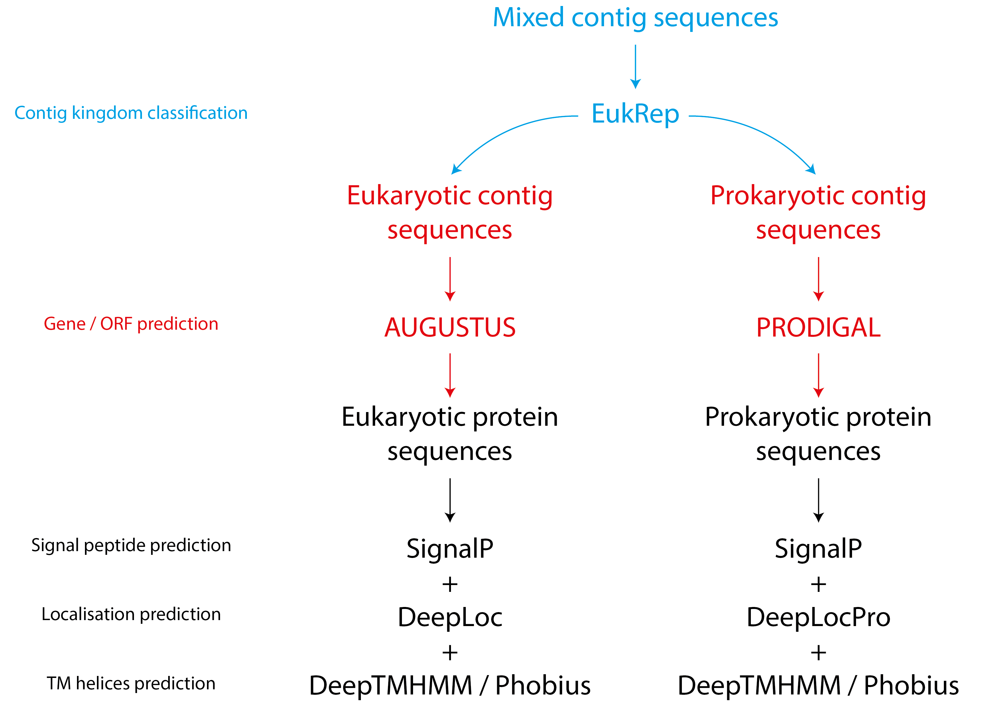

# metaLoc protein localisation pipeline
metaLoc is a reproducible [NextFlow](https://www.nature.com/articles/nbt.3820) workflow for protein localisation prediction utilising publicly available tools from both protein amino acid (aa) sequences or, in "meta" mode, from metagenomic nucleotide (nt) sequences. The workflow schematic can be seen below:

## Core workflow
The core workflow accepts protein sequence .fasta files as the input. For both eukaryotic and prokaryotic sequences the workflow utilises [SignalP 6.0](https://www.nature.com/articles/s41587-021-01156-3) in "euk" mode for eukaryotic sequences and in "other" mode for prokaryotic sequences for signal peptide prediction. Next [DeepLoc 2.1](https://academic.oup.com/nar/article/52/W1/W215/7642068) is utilised for eukaryotic protein localisation, and [DeepLocPro 1.0](https://academic.oup.com/bioinformatics/article/40/12/btae677/7900293) for prokaryotic protein localisation. Finally, transmembrane helices prediction is performed utilising either [Phobius 1.01](https://academic.oup.com/nar/article/35/suppl_2/W429/2920784) or [DeepTMHMM 1.0](https://www.biorxiv.org/content/10.1101/2022.04.08.487609v1) depending on the user preference. Despite its improved accuraccy, DeepTMHMM implemented here uploads sequences to the DeepTMHMM server for processing which could be time consuming for large datasets and unsuitable for sensitive data.

## Meta mode
For metagenomic nucleotide sequences (e.g. contigs) of known eukaryotic or prokaryotic origin, protein sequences can be predicted from the nucleotide sequences. [AUGUSTUS 3.5.0](https://academic.oup.com/bioinformatics/article/24/5/637/202844) is used alongside the user selected gene model to predict coding sequences from eukaryotic contigs. [Prodigal 2.6.3](https://link.springer.com/article/10.1186/1471-2105-11-119) is used for ORF prediction from prokaryotic contigs. For sequences of unknown origin (e.g. shotgun metagenomic contigs), [EukRep 0.6.7](https://pmc.ncbi.nlm.nih.gov/articles/PMC5880246/) is utilised for taxonomic classification of contigs into eukaryotic or prokaryotic contig sequences. Both branches of the pipeline are then performed simultaneously.  
